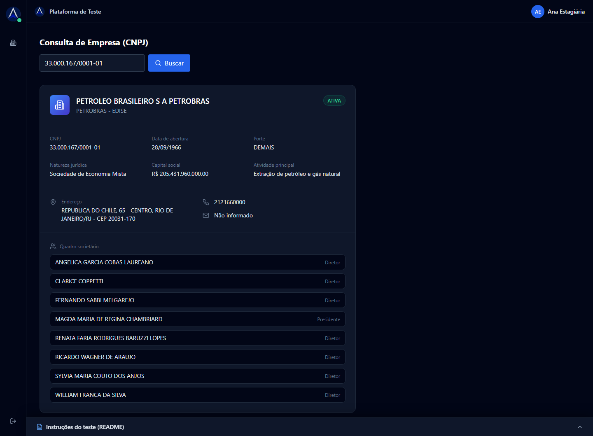
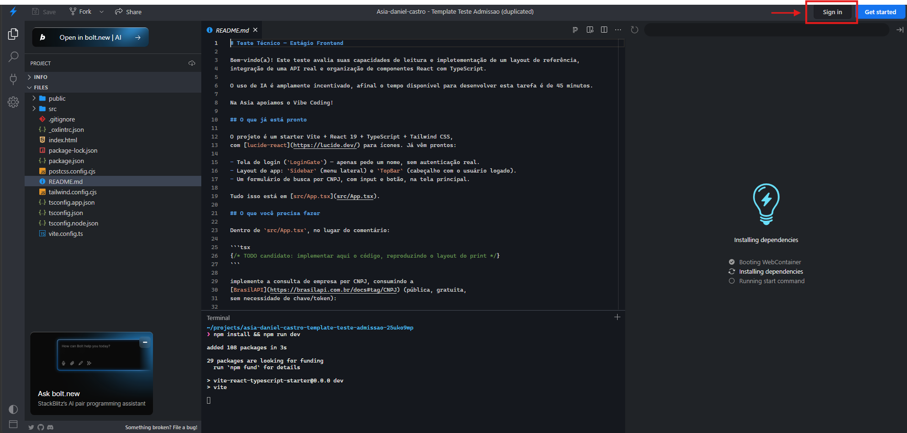
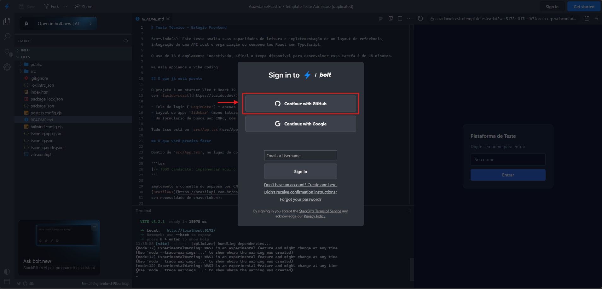
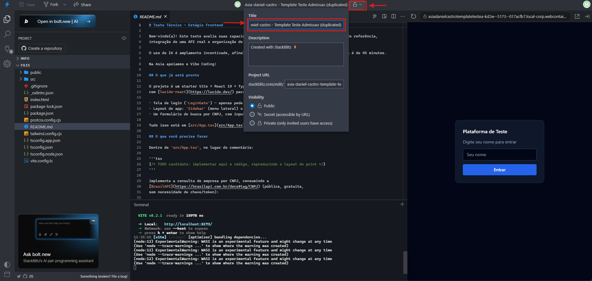

# Instruções Teste Técnico — Estágio

Bem-vindo(a)! Este teste avalia suas capacidades de leitura e impletementação de um layout de referência,
integração de uma API real e organização de componentes React com TypeScript. 

O uso de IA é amplamente incentivado, afinal o tempo disponível para desenvolver esta tarefa é de 45 minutos.

Na Asia apoiamos o Vibe Coding!

## O que já está pronto

O projeto é um starter Vite + React 19 + TypeScript + Tailwind CSS,
com [lucide-react](https://lucide.dev/) para ícones. Já vêm prontos:

- Tela de login (`LoginGate`) — apenas pede um nome, sem autenticação real.
- Layout do app: `Sidebar` (menu lateral) e `TopBar` (cabeçalho com o usuário logado).
- Um formulário de busca por CNPJ, com input e botão, na tela principal.

Tudo isso está em [src/App.tsx](src/App.tsx).

## O que você precisa fazer

Dentro de `src/App.tsx`, no lugar do comentário:

```tsx
{/* TODO candidato: implementar aqui o código, reproduzindo o layout do print */}
```

implemente a consulta de empresa por CNPJ, consumindo a
[BrasilAPI](https://brasilapi.com.br/docs#tag/CNPJ) (pública, gratuita,
sem necessidade de chave/token):

```
GET https://brasilapi.com.br/api/cnpj/v1/{cnpj}
```

O resultado esperado, reproduzindo o layout abaixo, é:



CNPJ usado no print acima (para você testar): `33.000.167/0001-01`.

### Requisitos obrigatórios

- **Card de resultado** com, no mínimo:
  - Razão social, nome fantasia e situação cadastral (com destaque visual
    para ativa/inativa);
  - CNPJ, data de abertura, porte, natureza jurídica, capital social e
    atividade principal;
  - Endereço completo, telefone e e-mail;
  - Quadro societário (nome e qualificação de cada sócio).

### Funcionalidades adicionais

- **Máscara/formatação** do CNPJ enquanto o usuário digita (`00.000.000/0000-00`).
- **Validação**: se o CNPJ não tiver 14 dígitos, exibir uma mensagem de erro
  sem chamar a API.
- **Estado de carregamento** no botão "Buscar" enquanto a requisição está em andamento.
- **Skeleton de carregamento** copiando o layout do quadro de resposta enquanto a requisição está em andamento.
- **Estado de erro**: se a API retornar erro (CNPJ inválido, inexistente,
  fora do ar), exibir uma mensagem amigável.

### O que avaliamos

- Fidelidade ao layout de referência (não precisa ser pixel-perfect, mas
  a estrutura, hierarquia e uso de cores/ícones devem ser equivalentes).
- Organização do código: componentes pequenos e coesos, tipagem correta
  em TypeScript (evite `any`).
- Tratamento de casos de borda (CNPJ inválido, sem nome fantasia, sem e-mail, etc.).
- Uso correto de React (estado, formulários controlados, eventos).

Não é necessário:

- Autenticação real, backend próprio ou persistência de dados.
- Testes automatizados.
- Responsividade completa para mobile (o foco é desktop).

## Como rodar o projeto

O link que você recebeu já abre o projeto rodando dentro do
StackBlitz — instalação e servidor de desenvolvimento sobem sozinhos,
não é necessário instalar nada localmente.

### Antes de começar: conecte sua conta do GitHub

Clique em **Sign in** no canto superior direito do StackBlitz:



Na janela que abrir, escolha **Continue with GitHub**:



Isso salva o projeto na sua conta com uma URL permanente — **é esse
link que você vai nos enviar ao final**, então não pule esse passo.

Depois de conectar, clique na setinha ao lado do título do projeto
(no topo da tela) para abrir o painel de configurações e **renomeie o
campo "Title" incluindo o seu nome**:



Assim conseguimos identificar de quem é cada projeto quando ele
aparecer para nós.

Um cronômetro no topo da tela mostra o tempo restante assim que você
entra com seu nome na tela de login do próprio app.

## Como entregar

Todo o teste — do início à correção — acontece dentro do próprio
StackBlitz. Não enviamos nem aceitamos `.zip`, e não é necessário criar
nenhum repositório à parte.

1. Confirme que você conectou sua conta do GitHub no StackBlitz (passo
   acima) antes de começar a editar.
2. Ao concluir (ou quando o tempo acabar), copie a URL do seu projeto
   direto da barra de endereço do navegador e envie esse link para
   quem te passou este teste.
3. Fique à vontade para descrever no próprio README, ou em uma mensagem
   junto da entrega, decisões que você tomou e o que faria diferente
   com mais tempo.

Qualquer dúvida sobre o enunciado, pergunte antes de começar — faz parte
do processo. Boa sorte!

**Agora basta minimizar esta janela, preencher seu nome e iniciar o
teste. Estas instruções poderão ser acessadas durante todo o teste.**
